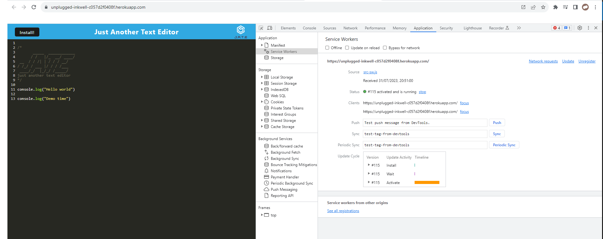

# UnpluggedInkwell - Progressive Web Application (PWA) Text Editor

UnpluggedInkwell is a browser-based text editor that functions as a progressive web application (PWA). As a PWA, it offers an app-like experience while being accessible from any modern web browser. The text editor is designed to work both online and offline, providing seamless access to your notes and code snippets regardless of your internet connection.

## Key Features:

### Single-Page Application (SPA): 
UnpluggedInkwell is built as a single-page application, ensuring a smooth and responsive user experience without the need for page reloads.

### Offline Functionality: 
The application leverages modern web technologies, allowing you to continue using the text editor even when you are offline.

### Data Persistence Techniques: 
To ensure your data is always safe, UnpluggedInkwell implements multiple data persistence techniques. These techniques act as redundancy measures in case some options are not supported by certain browsers.

### IndexedDB Integration: 
The text editor utilizes the IndexedDB database for efficient data storage and retrieval. This enables you to save and access your content with ease.

### Package 'idb' for IndexedDB: 
UnpluggedInkwell employs the 'idb' package, a lightweight wrapper around the IndexedDB API. Widely used by companies like Google and Mozilla, 'idb' provides convenient methods for interacting with the database.

## Deployment:

The UnpluggedInkwell text editor is deployed as a full-stack application on Heroku. For detailed instructions on how to deploy it, please follow the [Heroku Deployment Guide on The Full-Stack Blog](https://coding-boot-camp.github.io/full-stack/heroku/heroku-deployment-guide).

UnpluggedInkwell offers a user-friendly and intuitive interface, making it an excellent tool for creating and managing notes or code snippets. With its PWA capabilities, you can confidently use the text editor on various devices, even when an internet connection is not available./heroku-deployment-guide).

## User Story

```
AS A developer
I WANT to create notes or code snippets with or without an internet connection
SO THAT I can reliably retrieve them for later use
```

## Acceptance Criteria

```
GIVEN a text editor web application
WHEN I open my application in my editor
THEN I should see a client server folder structure
WHEN I run `npm run start` from the root directory
THEN I find that my application should start up the backend and serve the client
WHEN I run the text editor application from my terminal
THEN I find that my JavaScript files have been bundled using webpack
WHEN I run my webpack plugins
THEN I find that I have a generated HTML file, service worker, and a manifest file
WHEN I use next-gen JavaScript in my application
THEN I find that the text editor still functions in the browser without errors
WHEN I open the text editor
THEN I find that IndexedDB has immediately created a database storage
WHEN I enter content and subsequently click off of the DOM window
THEN I find that the content in the text editor has been saved with IndexedDB
WHEN I reopen the text editor after closing it
THEN I find that the content in the text editor has been retrieved from our IndexedDB
WHEN I click on the Install button
THEN I download my web application as an icon on my desktop
WHEN I load my web application
THEN I should have a registered service worker using workbox
WHEN I register a service worker
THEN I should have my static assets pre cached upon loading along with subsequent pages and static assets
WHEN I deploy to Heroku
THEN I should have proper build scripts for a webpack application
```

## Preview
J.A.T.E application launch:


J.A.T.E application manifest.json file:


J.A.T.E application registered service worker:


J.A.T.E application IndexedDB storage:


## Links
The URL of the deployed application: https://nataliecampbellgit.github.io/UnpluggedInkwell

The URL of the GitHub repository: https://github.com/NatalieCampbellGit/UnpluggedInkwell

The URL of the Heroku Application: https://unplugged-inkwell-c057d2f0408f.herokuapp.com
